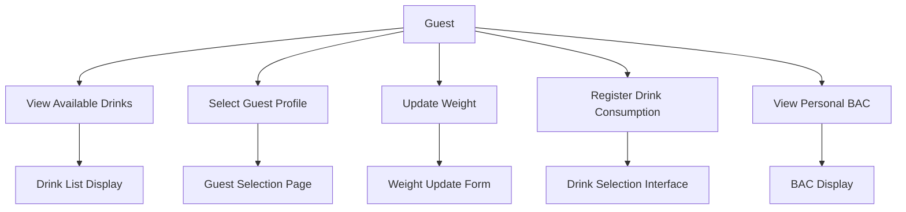
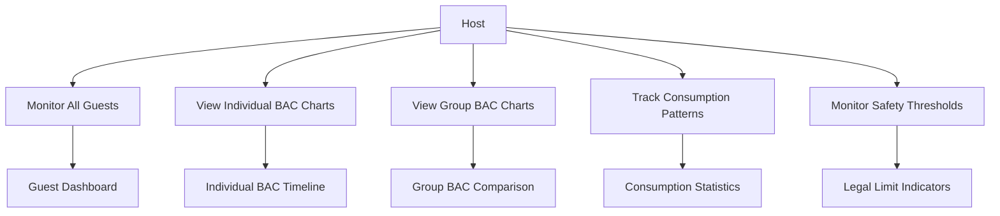
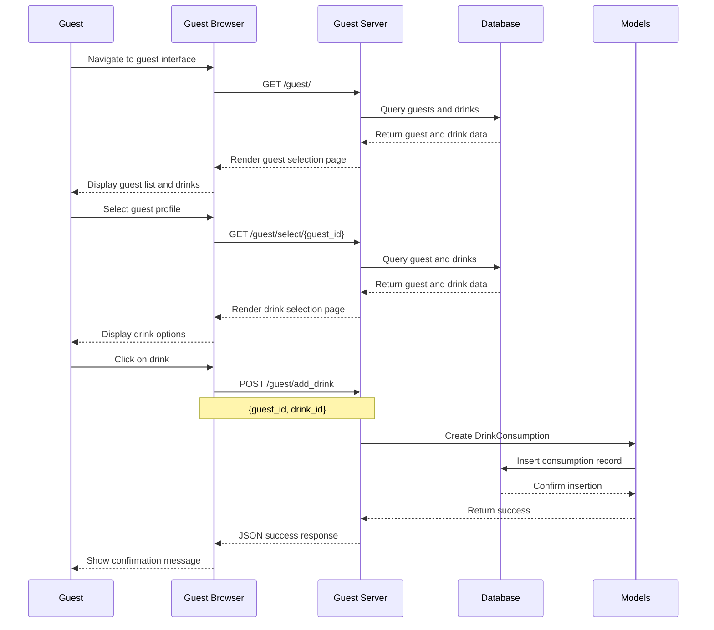
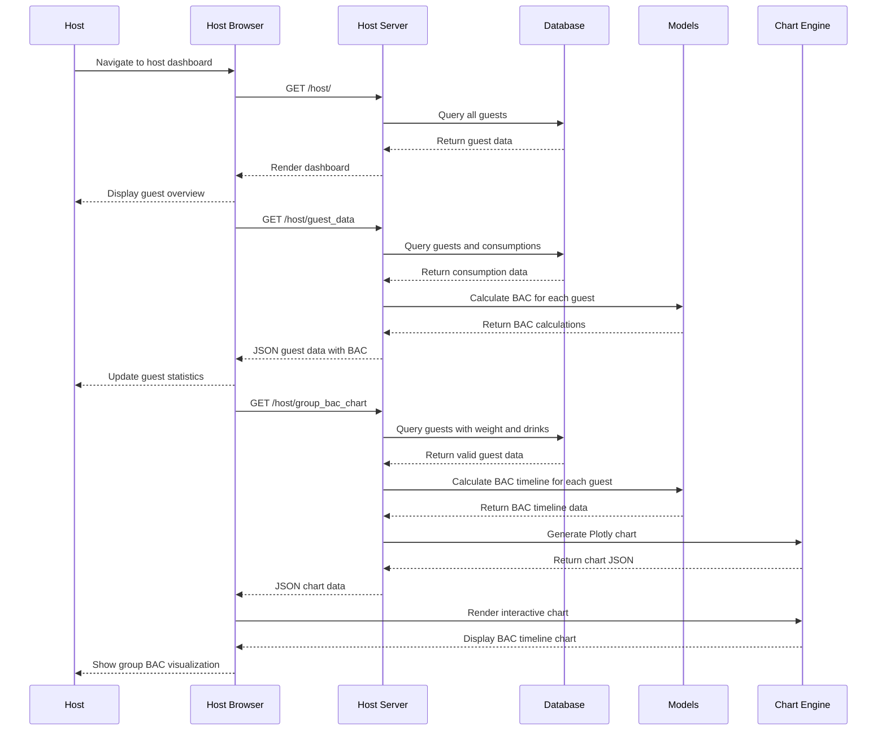
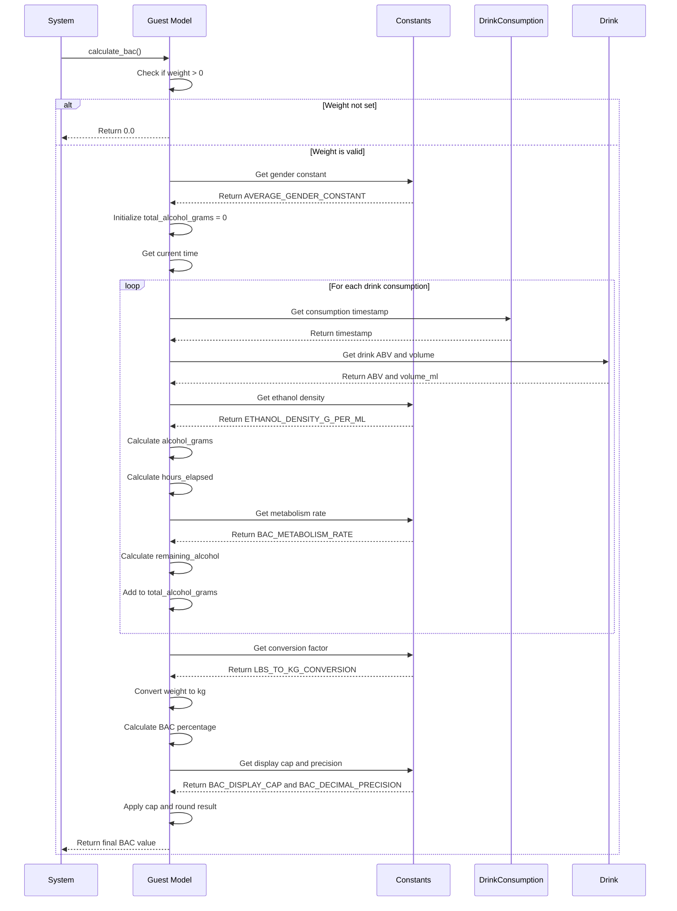
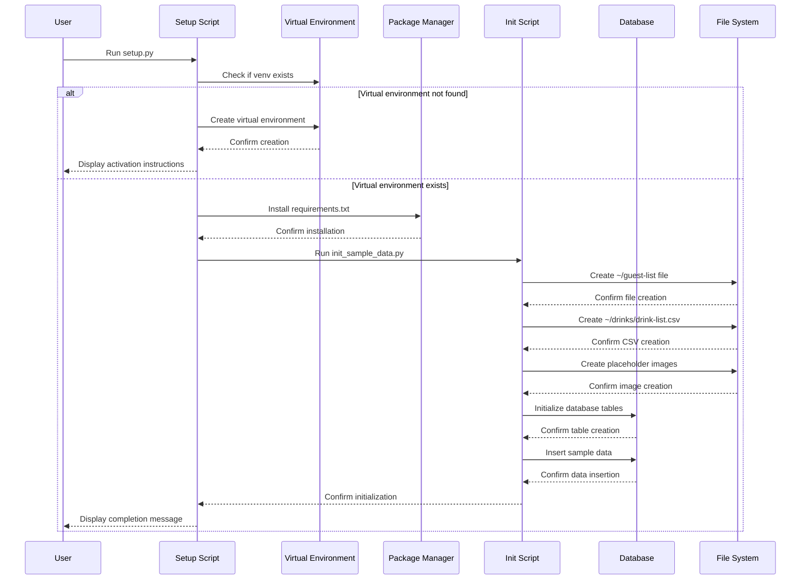
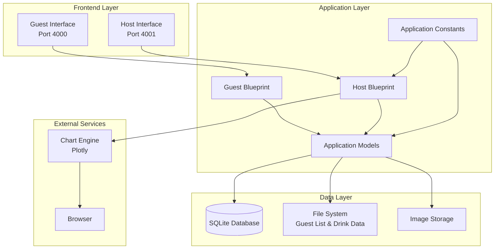
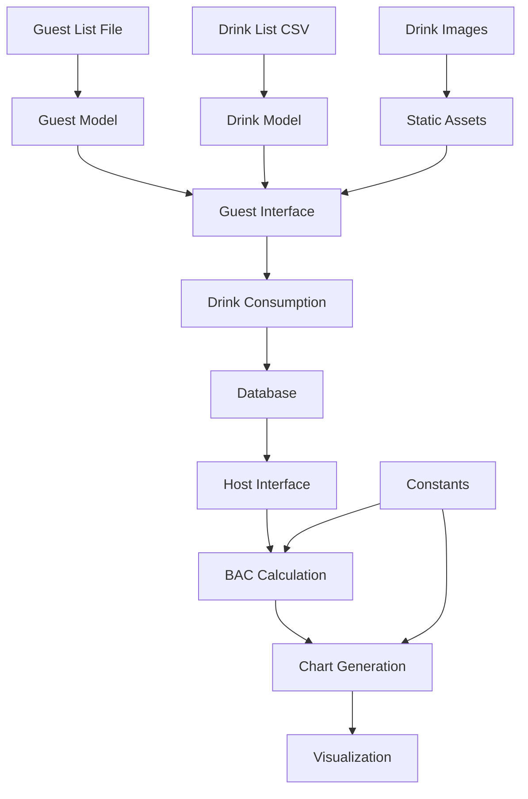
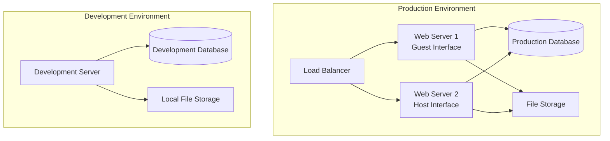

# High Level Design (HLD) - Party Drink Tracker

## Overview

The Party Drink Tracker is a web-based application designed to monitor alcohol consumption at parties and estimate Blood Alcohol Content (BAC) levels for safety purposes. The system consists of two main interfaces: a guest interface for drink registration and a host interface for monitoring and safety oversight.

## System Architecture

The application follows a modular Flask architecture with separate interfaces for guests and hosts, running on different ports (4000 and 4001 respectively). The system uses SQLite for data persistence and includes real-time BAC calculations with interactive charting capabilities.

## Class Diagram

```mermaid
classDiagram
    %% Main application classes
    class Guest {
        +int id
        +string name
        +float weight
        +List~Consumption~ drinks
        +calculate_bac() float
        +__repr__() string
    }

    class Drink {
        +int id
        +string name
        +string image_path
        +float abv
        +float volume_ml
        +List~Consumption~ consumptions
        +__repr__() string
    }

    class Consumption {
        +int id
        +int guest_id
        +int drink_id
        +datetime timestamp
        +__repr__() string
    }

    %% Blueprints
    class GuestBlueprint {
        +index() Response
        +select_guest(id) Response
        +add_drink() JSON
    }

    class HostBlueprint {
        +dashboard() Response
        +guest_data() JSON
        +bac_chart(id) JSON
        +group_bac_chart() JSON
    }

    %% Configuration
    class Constants {
        +ETHANOL_DENSITY
        +GENDER_CONSTANT
        +METABOLISM_RATE
        +WEIGHT_CONVERSION
        +BAC_DISPLAY_CAP
        +DECIMAL_PRECISION
    }

    %% Flask framework
    class Flask {
        +create_app()
        +register_blueprint()
        +run()
    }

    %% Relationships
    Guest ||--o{ Consumption : "consumes"
    Drink ||--o{ Consumption : "consumed as"
    GuestBlueprint --> Guest : "manages"
    GuestBlueprint --> Drink : "displays"
    GuestBlueprint --> Consumption : "creates"
    HostBlueprint --> Guest : "monitors"
    HostBlueprint --> Consumption : "analyzes"
    Guest --> Constants : "uses for BAC"
    HostBlueprint --> Constants : "uses for charts"
```

**Note**: `Consumption` represents `DrinkConsumption` class. All constant names have been abbreviated for diagram clarity.

## Use Case Diagrams

### Guest Use Cases



### Host Use Cases



## Sequence Diagrams

### Use Case 1: Guest Registers a Drink



### Use Case 2: Host Monitors Guest BAC Levels



### Use Case 3: BAC Calculation Process



### Use Case 4: System Initialization



## Component Architecture



## Data Flow Architecture



## Security Considerations

- **Input Validation**: All user inputs are validated before database operations
- **SQL Injection Prevention**: Uses SQLAlchemy ORM with parameterized queries
- **XSS Protection**: Flask-WTF provides CSRF protection and input sanitization
- **Data Privacy**: Guest data is stored locally and not transmitted externally
- **Access Control**: Host interface should be protected in production environments

## Performance Considerations

- **Database Optimization**: Uses SQLite with proper indexing on foreign keys
- **Chart Rendering**: Plotly charts are generated server-side and cached
- **Static Assets**: Images and CSS are served efficiently through Flask static routing
- **Memory Management**: BAC calculations are performed on-demand to minimize memory usage

## Scalability Considerations

- **Database Migration**: Easy migration path to PostgreSQL or MySQL for larger deployments
- **Load Balancing**: Multiple server instances can be deployed behind a load balancer
- **Caching**: Redis can be integrated for session management and chart caching
- **Microservices**: Components can be separated into independent services if needed

## Deployment Architecture



## Technology Stack

- **Backend**: Python 3.12, Flask 2.3.3, SQLAlchemy
- **Frontend**: HTML5, CSS3, JavaScript, Bootstrap
- **Charts**: Plotly.js
- **Database**: SQLite (development), PostgreSQL/MySQL (production)
- **Image Processing**: Pillow (PIL)
- **Deployment**: Gunicorn, Nginx (production)

## Future Enhancements

- **Real-time Updates**: WebSocket integration for live BAC monitoring
- **Mobile App**: React Native or Flutter mobile application
- **Advanced Analytics**: Machine learning for consumption pattern analysis
- **Integration**: API endpoints for third-party integrations
- **Multi-party Support**: Support for multiple simultaneous parties
- **Advanced BAC Models**: Gender-specific and food consumption factors
